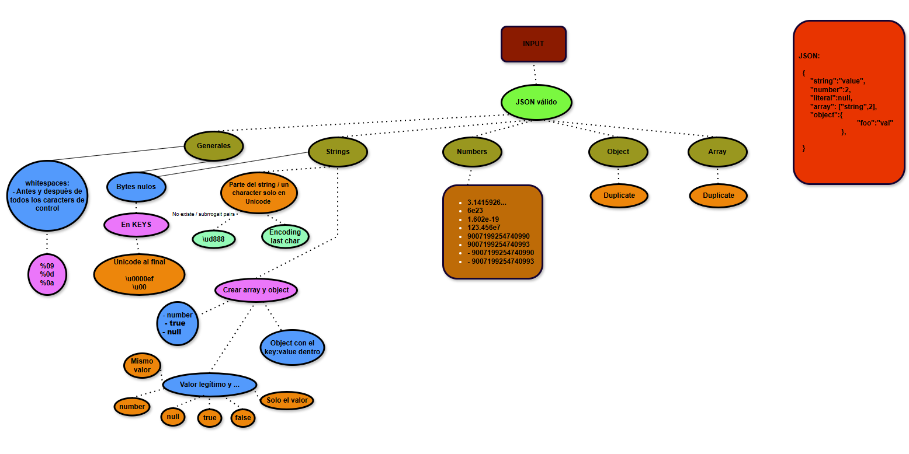
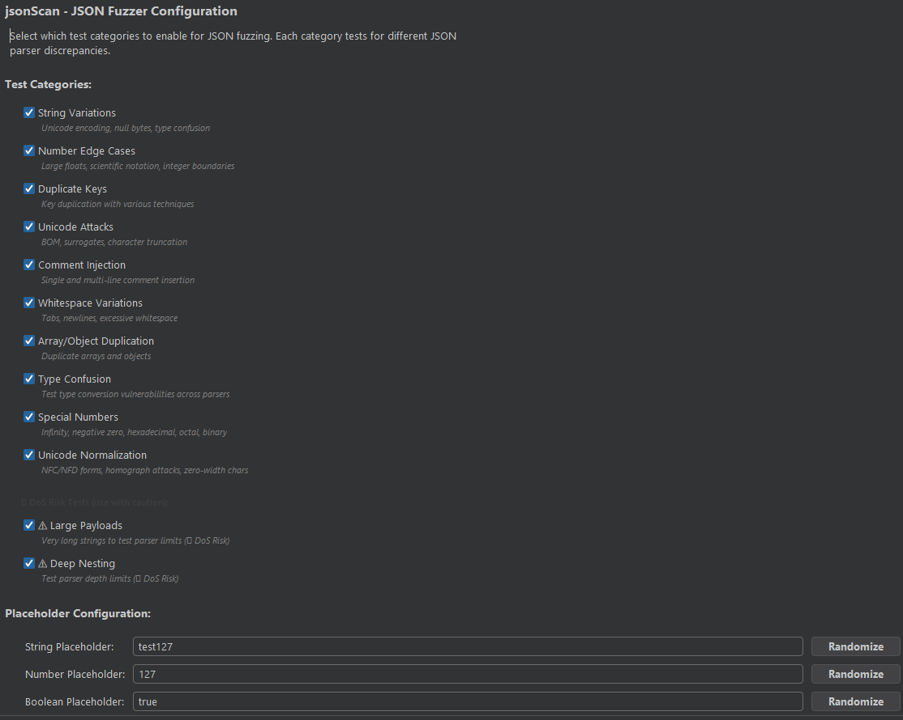
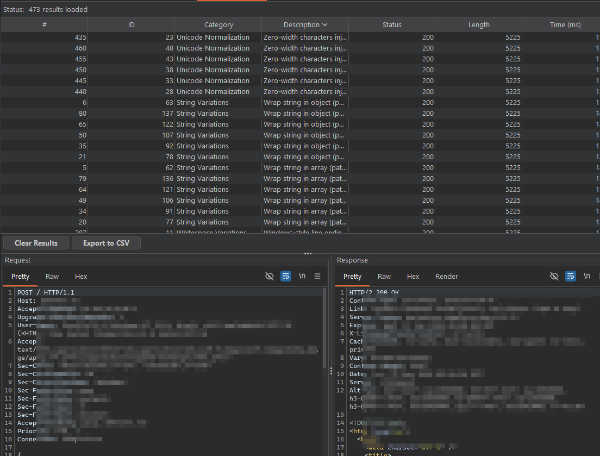

# jsonScan - JSON Fuzzing Extension for Burp Suite

A comprehensive JSON fuzzing extension for Burp Suite that detects parser discrepancies and interoperability vulnerabilities across different JSON implementations.

## Overview

jsonScan generates systematic permutations of JSON payloads to identify how different parsers handle edge cases, malformed inputs, and ambiguous specifications. This tool helps discover vulnerabilities arising from inconsistent JSON parsing behavior between frontend and backend systems.

### Contexto
- Esto surge de la necesidad de tener una herramienta propia, modular, para poder hacer pruebas un poquito más avanzadas en JSONs. Hay herramientas de este tipo ( y probablemente mejor codeadas) que ya hacen esta función, pero no integradas en Burp como extensión. Era un follón, poco usable, tener que coger el output de otra tool y probar el JSON con intruder o similar
- Está medio vibe-codeado. No esperes una calidad tremenda
- Hice un primer prototipo en python que hacía exactamente eso, darte una lista de "payload" JSON con permutaciones. Aquí el primer diseño:
  


- Screenshots de la extensión actual:


 

## Installation

1. Build the extension:
   ```bash
   ./gradlew jar
   ```

2. Load the JAR in Burp Suite:
   - Navigate to Extensions → Installed → Add
   - Select `build/libs/ExtensionTemplateProject.jar`

3. Configure settings in the "jsonScan Settings" tab

## Usage

1. Capture a request with JSON body in Burp Suite (Proxy, Repeater, etc.)
2. Right-click on the request → "jsonScan: Fuzz!"
3. Review results in the "jsonScan Results" tab

## Test Categories

### 1. String Variations (15 tests per string)

Tests Unicode encoding variations, type confusion, and character manipulation:

- **Unicode encode last character**: `"admin"` → `"admi\u006E"`
- **Unpaired surrogate at end**: `"admin"` → `"admin\ud888"`
- **Null byte Unicode injection**: `"admin"` → `"admin\u0000ef"`
- **Wrap in array**: `"admin"` → `["admin"]`
- **Wrap in object**: `"username":"admin"` → `"username":{"admin":"admin"}`
- **Array with extra value**: `"admin"` → `["admin", "FZZ123"]`
- **Array with boolean true**: `"admin"` → `["admin", true]`
- **Array with boolean false**: `"admin"` → `["admin", false]`
- **Array with null**: `"admin"` → `["admin", null]`
- **Partial Unicode encoding**: `"admin"` → `"ad\u006D\u0069\u006E"`
- **Backslash as Unicode prefix**: `"value"` → `"\u005Cvalue"`
- **Incomplete Unicode escape**: `"value"` → `"value\u00"`
- **BOM prefix**: `"value"` → `"\uFEFFvalue"`
- **Stray quote at end**: `"value"` → `"value\""`
- **Carriage return at end**: `"value"` → `"value\r"`

### 2. Number Edge Cases (9 tests per number)

Tests numerical boundaries and precision limits:

- **Long float**: `3.141592653589793238462643383279`
- **Very large exponent**: `1.0e4096`
- **Scientific notation**: `6e23`
- **Negative exponent**: `1.602e-19`
- **Decimal with exponent**: `123.456e7`
- **Integer boundary**: `9007199254740990` (near 2^53-1)
- **Beyond boundary**: `9007199254740993` (beyond 2^53-1)
- **Negative boundary**: `-9007199254740990`
- **Negative beyond**: `-9007199254740993`

### 3. Type Confusion (7 tests per field)

Tests type conversion vulnerabilities across parsers:

- **NaN string injection**: `"admin"` → `"NaN"`
- **Unquoted NaN**: `123` → `NaN` (invalid JSON, accepted by some parsers like JavaScript)
- **Replace with null**: `"admin"` → `null`
- **Replace with true**: `123` → `true`
- **Replace with false**: `"test"` → `false`
- **Number to string**: `123` → `"123"`
- **String to number**: `"456"` → `456`

### 4. Special Numbers (6 tests per number)

Tests non-standard numeric representations:

- **Positive infinity**: `123` → `"Infinity"`
- **Negative infinity**: `123` → `"-Infinity"`
- **Negative zero**: `123` → `"-0"`
- **Hexadecimal notation**: `255` → `"0xFF"`
- **Octal notation**: `511` → `"0o777"`
- **Binary notation**: `10` → `"0b1010"`

### 5. Unicode Normalization (5 tests per string)

Tests Unicode normalization attacks:

- **NFC normalization**: `"café"` → `"café"` (composed form)
- **NFD normalization**: `"café"` → `"café"` (decomposed form)
- **Homograph attacks**: `"admin"` → `"аdmin"` (Cyrillic 'а' vs Latin 'a')
- **Zero-width characters**: `"admin"` → `"admin\u200B\u200C\u200D\uFEFF"`
- **Right-to-left override**: `"admin"` → `"\u202Eadmin\u202C"`

### 6. Large Payloads(2 tests per string)

Tests parser memory and buffer limits:

⚠️ **WARNING - DoS Risk**: These tests generate very large payloads that can cause memory exhaustion, slow parsing, or system crashes. Use with extreme caution and disable when testing production systems.

- **10KB payload**: Generates 10,240 character string
- **100KB payload**: Generates 102,400 character string

### 7. Duplicate Keys (9+ tests per key)

Tests parser precedence for duplicate keys with focus on key ordering to detect first-key vs last-key precedence:

#### Order-Based Duplicate Tests (9 tests per key):

**Testing Last-Key Precedence (duplicate AFTER original):**
- **Same value after**: `{"user":"admin", "user":"admin"}`
- **Different value after**: `{"user":"admin", "user":"FZZ123"}`
- **Unicode variation after**: `{"user":"admin", "use\u0072":"FZZ123"}`
- **Unpaired surrogate after**: `{"user":"admin", "user\ud888":"FZZ123"}`
- **Null byte after**: `{"user":"admin", "user\u0000ef":"FZZ123"}`

**Testing First-Key Precedence (duplicate BEFORE original):**
- **Different value before**: `{"user":"FZZ123", "user":"admin"}`
- **Same value before**: `{"user":"admin", "user":"admin"}`
- **Unicode variation before**: `{"use\u0072":"FZZ123", "user":"admin"}`
- **Unpaired surrogate before**: `{"user\ud888":"FZZ123", "user":"admin"}`

**Why Order Matters:**
- **First-key parsers** (Go, C++, Java json-iterator): Use the FIRST occurrence
- **Last-key parsers** (JavaScript, Python, Ruby): Use the LAST occurrence
- Testing both orders reveals which precedence the parser uses

**Example Scenario:**
```json
Original: {"rt":"v2","rt2":["test1","test2"]}

Test AFTER (last-key precedence):
{"rt":"v2","rt2":["test1","test2"], "rt":"FZZ123"}
→ First-key parsers see: "v2"
→ Last-key parsers see: "FZZ123" ✓

Test BEFORE (first-key precedence):
{"rt":"FZZ123", "rt":"v2","rt2":["test1","test2"]}
→ First-key parsers see: "FZZ123" ✓
→ Last-key parsers see: "v2"
```

By testing BOTH orders, we can definitively identify which precedence each parser uses.

#### For Object Values:
- Remove each property individually
- Empty object variation: `{"data":{}, "data":{}}`

#### For Array Values:
- Remove each element individually
- Empty array variation: `{"items":[], "items":[]}`
- First element only: `{"items":["a","b"], "items":["a"]}`
- Last element only: `{"items":["a","b"], "items":["b"]}`

### 8. Unicode Attacks (7 tests per string)

Tests character truncation and Unicode edge cases:

- **Unpaired surrogate \ud800**: `"value\ud800"`
- **Unpaired surrogate \ud888**: `"value\ud888"`
- **Stray backslash**: `"value\\"`
- **BOM at start**: `"\uFEFFvalue"`
- **Incomplete Unicode escape**: `"value\u00"`
- **Backslash as Unicode**: `"value\u005C"`
- **Null byte**: `"value\u0000ef"`

### 9. Comment Injection (7 tests total)

Tests parser behavior with JavaScript-style comments:

- **Single-line comment at start**: `// Comment\n{"key":"value"}`
- **Multi-line comment at start**: `/* Comment */{"key":"value"}`
- **Comment between properties**: `{"a":1 // comment\n, "b":2}`
- **Multi-line comment between properties**: `{"a":1 /* comment */ , "b":2}`
- **Comment after colon**: `{"key": // comment\n "value"}`
- **Comment-like text in string**: `{"key":"value// not a comment"}`
- **Nested comments**: `/* Outer /* Inner */ comment */{"key":"value"}`

### 10. Whitespace Variations (7 tests total)

Tests whitespace handling:

- **Replace spaces with tabs**: All spaces → `\t`
- **Newlines after structural characters**: `{`, `}`, `[`, `]`, `,` followed by `\n`
- **Excessive whitespace**: 4+ spaces around structural characters
- **Mixed whitespace**: Combination of spaces, tabs, newlines
- **Windows line endings (CRLF)**: `\r\n` instead of `\n`
- **Minified (no whitespace)**: All whitespace removed
- **Unicode whitespace**: Non-breaking space (`\u00A0`), em space (`\u2003`)

### 11. Deep Nesting ⚠️ (12 tests total)

Tests parser depth limits at 4 levels: 50, 100, 500, 1000

#### Nested Objects (4 tests):
```json
{"level":0, "nested":{"level":1, "nested":{"level":2, ...}}}
```

#### Nested Arrays (4 tests):
```json
[[[[["deep"]]]]]
```

#### Mixed Nesting (4 tests):
```json
{"level0":[{"level1":[{"level2": ...}]}]}
```

**Recommendations**:
- Test at lower depths (50, 100) before attempting 500 or 1000
- Some parsers have depth limits (e.g., 20-100 levels)
- Monitor CPU and memory during execution
- Disable for production system testing

### 12. Array/Object Duplication (variable tests)

Tests handling of duplicated structures:

#### For Arrays:
- **Duplicate elements (2x)**: `["a","b"]` → `["a","b","a","b"]`
- **Triple elements (3x)**: `["a","b"]` → `["a","b","a","b","a","b"]`

#### For Objects:
- **Duplicate with suffix**: `{"user":{...}, "user_duplicate":{...}}`
- Applied recursively to all nested objects

## Test Coverage Examples

### Simple JSON
```json
{"username":"admin"}
```
**Estimated tests**: ~50 permutations

### Nested JSON
```json
{"user":"admin", "data":["item1", "item2"], "count":42}
```
**Estimated tests**: ~300+ permutations (with all categories enabled)

### Complex JSON
```json
{
  "user":"admin",
  "profile":{
    "name":"John",
    "age":30
  },
  "items":["a","b","c"]
}
```
**Estimated tests**: ~500+ permutations (with all categories enabled)

### Placeholder Values

Configure placeholder values used in fuzzing tests:

- **String Placeholder**: Default `"FZZ123"` (used in duplicate key tests, array expansions)
- **Number Placeholder**: Default `999999` (used in type confusion tests)
- **Boolean Placeholder**: Default `true` (used in type conversion tests)

### Enabling/Disabling Test Categories

Selectively enable test categories in the Settings tab:

- ✅ Enable all for comprehensive testing in safe environments
- ⚠️ Disable "DoS Risk Tests" when testing production systems
- 🎯 Enable specific categories for targeted testing
- 🔒 DoS tests are clearly marked with orange warning border in UI

## Known Parser Discrepancies

### First-key Precedence
Some parsers take the first value when keys are duplicated:
- Go (jsonparser, gojay)
- C++ (rapidjson)
- Java (json-iterator)

### Last-key Precedence
Other parsers take the last value:
- JavaScript (JSON.parse)
- Python (json, ujson)
- Ruby (most implementations)

### Character Truncation
Parsers may truncate at different characters:
- Unpaired surrogates: Python ujson, PHP json5
- Carriage return: Rust json5, PHP json5
- Stray backslash: Ruby, JavaScript json5

### Unexpected Comment Support
Some parsers accept comments despite RFC 8259:
- Ruby (stdlib, oj, Yajl)
- Go (jsonparser, gojay)
- Java (GSON, Genson, fastjson)
- C# (Newtonsoft.Json, Utf8Json)

## Development

### Building from Source
```bash
# Build extension JAR
./gradlew jar

# Clean build artifacts
./gradlew clean

# Build and run tests
./gradlew build
```

### Project Structure
```
src/main/java/
├── Extension.java              # Main entry point
├── jsonScan/
│   ├── core/
│   │   ├── JsonFuzzer.java     # Orchestrator
│   │   └── FuzzingOrchestrator.java
│   ├── generators/             # Test generators
│   │   ├── StringTestGenerator.java
│   │   ├── NumberTestGenerator.java
│   │   ├── TypeConfusionGenerator.java
│   │   ├── SpecialNumberGenerator.java
│   │   ├── UnicodeNormalizationGenerator.java
│   │   ├── LargePayloadGenerator.java
│   │   ├── DuplicateKeyGenerator.java
│   │   ├── UnicodeTestGenerator.java
│   │   ├── CommentInjectionGenerator.java
│   │   ├── WhitespaceGenerator.java
│   │   ├── NestingGenerator.java
│   │   └── ArrayObjectDuplicationGenerator.java
│   ├── models/                 # Data models
│   ├── ui/                     # User interface
│   └── utils/                  # Utilities
```
